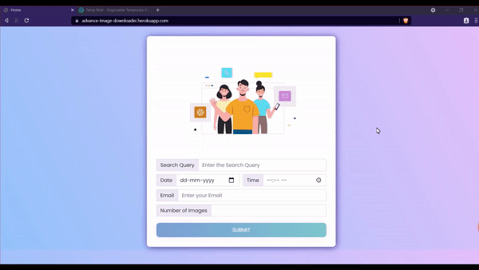
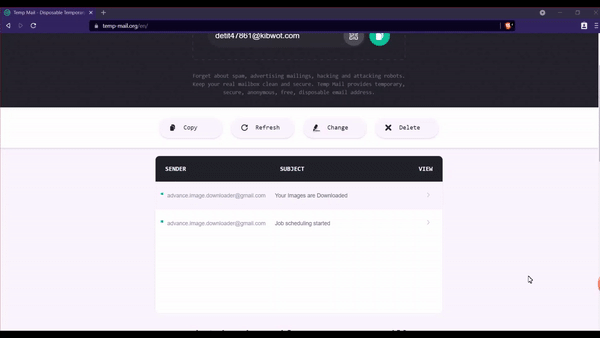
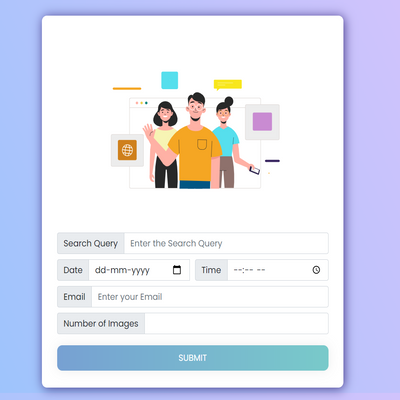
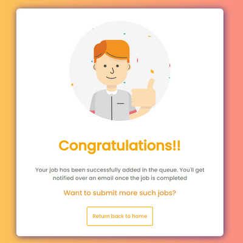
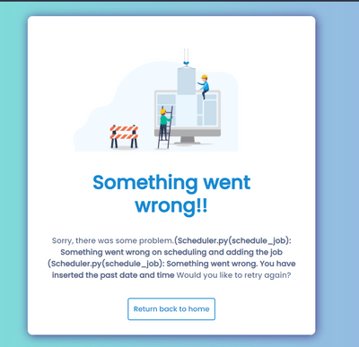

# <center>Advance Image Downloader/Extractor(Job)


Advance Image Downloader/Extractor (Job) is a Python-Flask web-based app, which will help the user download the any kind of Images at any date and time over the internet. These images will get downloaded as a job and then let user know that the images have been downloaded by sending them a link over an email.


## <center>Appendix

There are often a times, we need bunch images to work. We can consider the example such as training the Machine learning model over the Cat and Dog images or having those hundreds of beautiful desktop/mobile wallpaper on our laptop with just single click. In such scenario’s we need hundreds of images right away. This problem can be solved using the Advance Image Downloader application. The following use cases can be implemented: 
-	To download the specified number of images of the particular type
-	To send the downloadable link to the user over an email
-	To let user download the image through just single click on link


  
## <center>Features

- Responsive UI
- Upto 500 images on single click
- Email notification of the job activites
- Cross platform

## <center>Demo of project

<p> Click here for the project demo :- <a href = 'https://advance-image-downloader.herokuapp.com' target="_blank">Project Demo</a></p>


<h3>1. Submitting the job</h3>
<p align="center">
  
</p>

<h3>2. Downloading the files</h3>
<p align="center">
  
</p>


## <center>Screenshots

<h3>1. Homescreen</h3>
<p align="center">
  
</p>

<h3>2. Submitted</h3>
<p align="center">
  
</p>


<h3>3. Error</h3>
<p align="center">
  
</p>

  
## <center>Run Locally

Clone the project

```bash
  git clone https://github.com/Sparab16/Advance-Image-Downloader
```

Go to the project directory

```bash
  cd Advance-Image-Downloader
```

Install dependencies

```bash
  pip install -r requirements.txt
```

Setting up the config files

```markdown
    Update the values inside the config folder
```

Run the app.py

```bash
  python app.py
```

  
## <center>Usage

### Development

Want to contribute? Great!

To fix a bug or enhance an existing module, follow these steps:

<li> Fork the repo
<li> Create a new branch

```bash
 git checkout -b new-feature
```
<li> Make the appropriate changes in the file
<li> Commit your changes

```bash
git commit -am "New feature added"
```

<li> Push to the branch

```bash
git push origin new-feature
```

<li> Create a pull request

### Bug/Feature Request
If you find any bug or have some idea about a new feature that can be implemented, you can either open an issue <a href='https://github.com/Sparab16/Advance-Image-Downloader/issues' target="_blank">here</a> or you can directly mail us at advance-image-downloader@gmail.com.

Please include the sample queries and their corresponding results.

## <center>Tech Stack

### Project is built with:-

**Client:** 
- <a href='python.org' target="_blank">Python </a>
- <a href='https://developer.mozilla.org/en-US/docs/Web/HTML' target="_blank">HTML</a>
- <a href='https://www.w3.org/Style/CSS/Overview.en.html' target="_blank">CSS</a>
- <a href='https://developer.mozilla.org/en-US/docs/Web/JavaScript' target="_blank">JavaScript</a>
- <a href='https://getbootstrap.com/' target="_blank">Bootstrap
</a>


**Server:** 
- <a href='https://flask.palletsprojects.com/en/2.0.x/' target="_blank">Flask</a>
- <a href='https://www.selenium.dev/' target="_blank">Selenium</a>

**Database:** 
- <a href='https://www.datastax.com/' target="_blank">Cassandra</a>

  
## Authors

- [@Shreyas](https://github.com/Sparab16)
- [@Harshad](https://github.com/harshad5498)


  
## Optimizations

<li>Since the upto 500 images are supported the filesize can get very large. That's why we have used the zip functionality to reduce the file size.</li>
<li>It is scalable as many users can request for images at the same time.</li>

 
# Hello, I'm Shreyas! 👨🏼‍💻

  
## 🔗 Links
[](https://www.linkedin.com/in/shrey16/)

  
## Feedback

If you have any feedback, please reach out to us at advance-image-downloader@gmail.com

  
## FAQ

#### Do user have to wait until images get downloaded?

Ans - No. User can simply submit the job and then close the browser and continue doing other tasks. Once the task starts user will get email about the process activities.

#### How much images can be downloaded at single go?

Ans - Upto 500 images can be downloaded at single time. If more required we can simple submit the query again.

#### How will I know if my job suddenly stops in the background?
Ans - If some error occurs at the backend the user will get email notification  informing  about the issue and also the link to again retry scheduling the job again.
  
## Documentation

[High level design documentation](Docs/Advance_Image_Generator-HLD.docx)<br>

[comment]: <> ([Low level design documentation]&#40;https://linktodocumentation&#41;<br>)

[comment]: <> ([Wireframe]&#40;Docs/Advance-Image-Downloader_Wireframe.pdf&#41;<br>)

[comment]: <> ([Architecture]&#40;https://linktodocumentation&#41;)

  